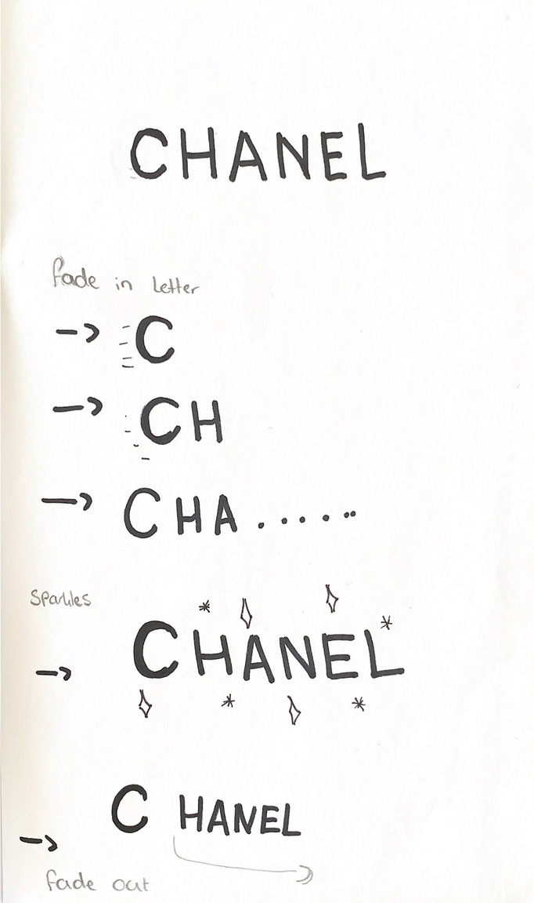
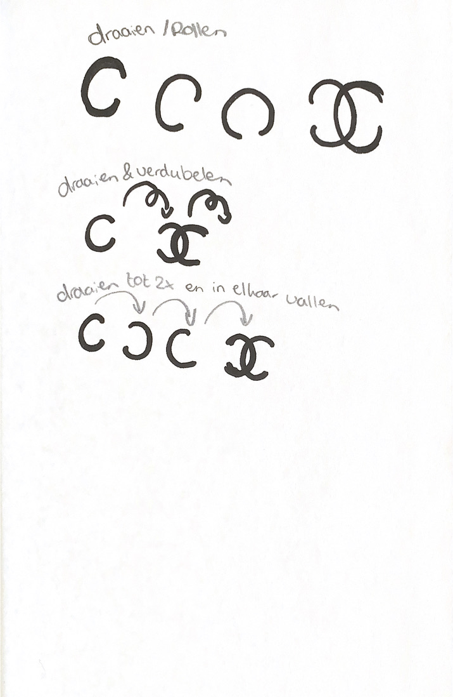
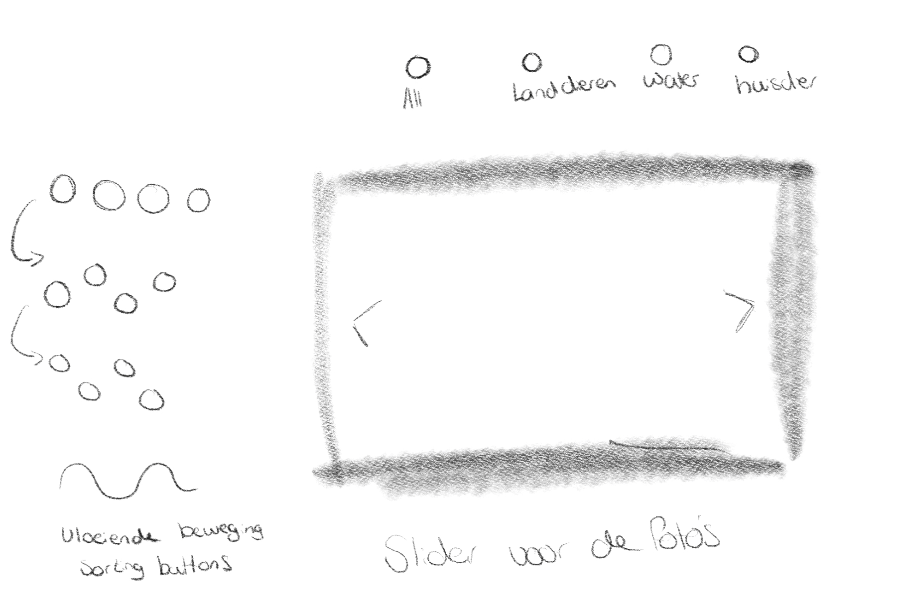
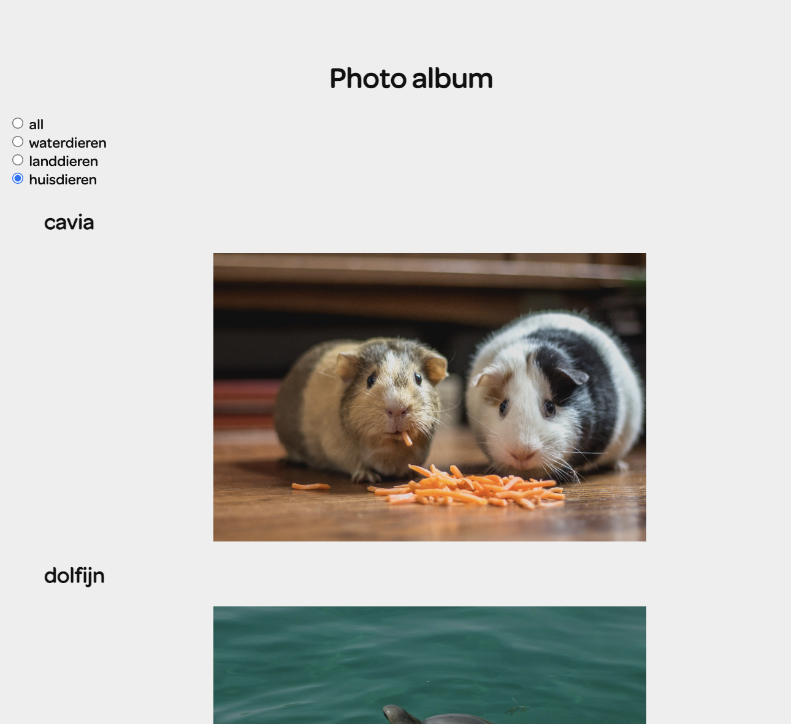
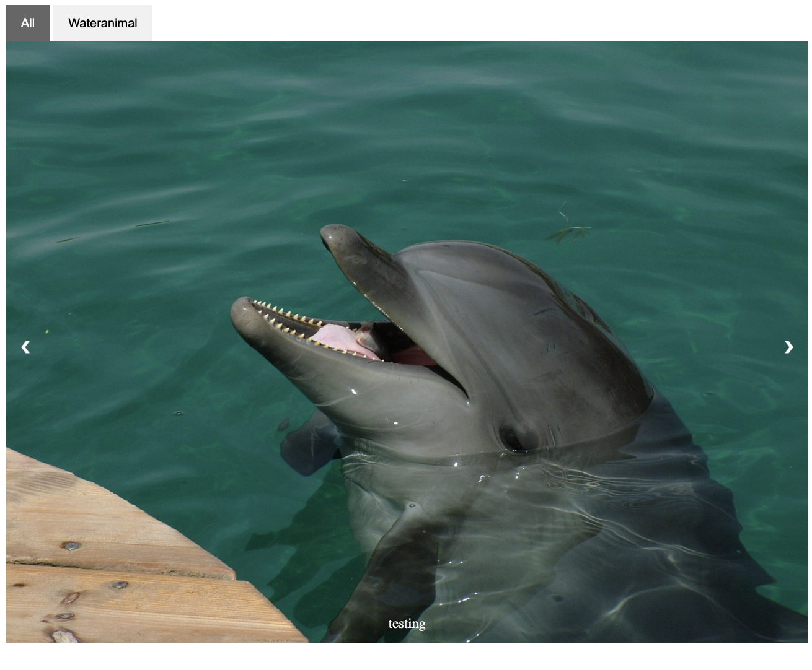
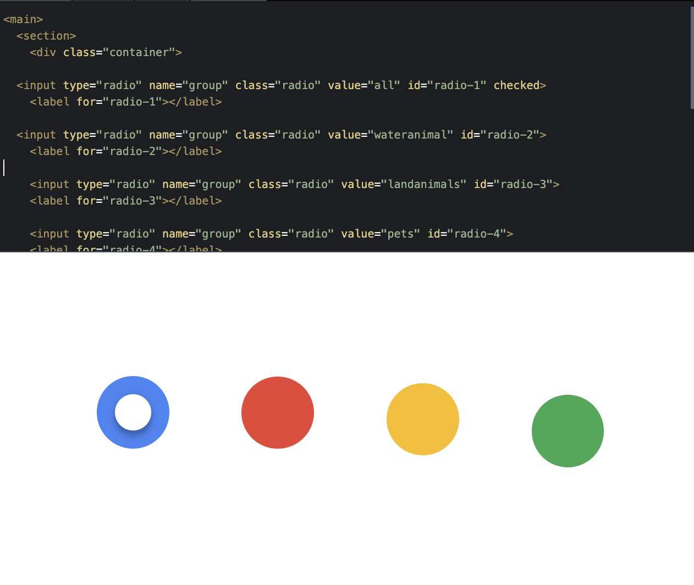

# Procesverslag
**Auteur:** Isabel Kok

**De opdrachten:** [opdracht 1](opdracht1/index.html) en [opdracht 2](opdracht2/index.html)

Markdown is een simpele manier om HTML te schrijven.  
Markdown cheat cheet: [Hulp bij het schrijven van Markdown](https://github.com/adam-p/markdown-here/wiki/Markdown-Cheatsheet).

Nb. De standaardstructuur en de spartaanse opmaak van de README.md zijn helemaal prima. Het gaat om de inhoud van je procesverslag. Besteedt de tijd voor pracht en praal aan je website.

Nb. Door *open* toe te voegen aan een *details* element kun je deze standaard open zetten. Fijn om dat steeds voor de relevante stuk(ken) te doen.

## Bronnenlijst
  1. https://bennettfeely.com/clippy/ voor het gebruik van maken van de sparkles
  2. https://developer.mozilla.org/en-US/docs/Web/CSS/@keyframes voor kijken naar keyframes
  3. -...-

## Opdracht 1 plan

  
uitwerken na schetsen idee (voor week 2)

  ### Je storyboard:
  

   

  ### Je ambitie: 
  Aan deze technieken/punten wil ik werken:
  - er achter komen hoe @keyframes werken en wat ik daar allemaal mee kan doen.
  - Ervoor zorgen dat ik meer kennis op doe in het leren hoe je beter kan coderen.
  - Ik wil werken aan dat ik zelf uit meer dingen kan komen want ik vind het wel lastig om soms zelf de oplossing te zien.
  - ...
 

## Opdracht 1 reflectie

  
uitwerken bij afronden opdracht (voor week 4)

  ### Je uitkomst - karakteristiek screenshot(s):
  

  ### Dit ging goed/Heb ik geleerd: 
  Korte omschrijving met plaatje(s)
  - ik ben lekker gaan kijken hoe ik met verschillende keyframes wat kan laten bewegen.
  - het font was eerst lasig maar dat foutje zat in een klein hoekje dus opzicht ging dat ook goed. 

  

  ### Dit was lastig/Is niet gelukt:
  Korte omschrijving met plaatje(s)
  - het is nog niet gelukt om me c van chanel te laten draaien tot in het logo te laten komen.
  - ik weet ook niet hoe ik er voor kan zorgen dat de animatie niet weer terug komt zegmaar dat de sterretjes er in het begin niet blijven staan.
  - ik moet ook nog kijken hoe mijn sterretjes in het midden blijven 
  - 

  

## Opdracht 2 plan

  
uitwerken na schetsen idee (voor week 5)

  ### Je ontwerp:
  

  ### Je ambitie: 
  Aan deze technieken/punten wil ik werken:
  - hoe een sorteringssysteem werkt 
  - hoe ik met meerdere manieren kan bewegen
  - swiper/ carousel maken
  - ...

## Opdracht 2 test

  
uitwerken na testen (week 7)

  Neem minimaal 5 bevindingen op:

  ### Bevindingen:
  Omschrijving van wat er nog niet orde was (tekst en afbeeding(en)).
- het swipe systeem
- hoe je met meerdere manieren kon besturen
- kleine animatie er in toevoegen

  #### oplossing:
  - via javascript 
  - is niet gelukt of nouja klikken kan
  - heb ik wel in codepen

  ### Bevinding 2:
  alles bij elkaar ! En ik vind het echt jammer dat het me niet is gelukt. 

  #### oplossing:
  Als ik het zou kunnen oplossen had ik een mooi eindresultaat gekregen denk ik maar jammergenoeg is dit niet gelukt. 

## Opdracht 2 reflectie

  
uitwerken bij afronden opdracht (voor week 8)

  ### Je uitkomst - karakteristiek screenshot(s):
  
 
 
  ### Dit ging goed/Heb ik geleerd: 
  Korte omschrijving met plaatje(s)

  

  ### Dit was lastig/Is niet gelukt:
  Korte omschrijving met plaatje(s)
- alle dingen bij elkaar toevoegen is niet gelukt
  

